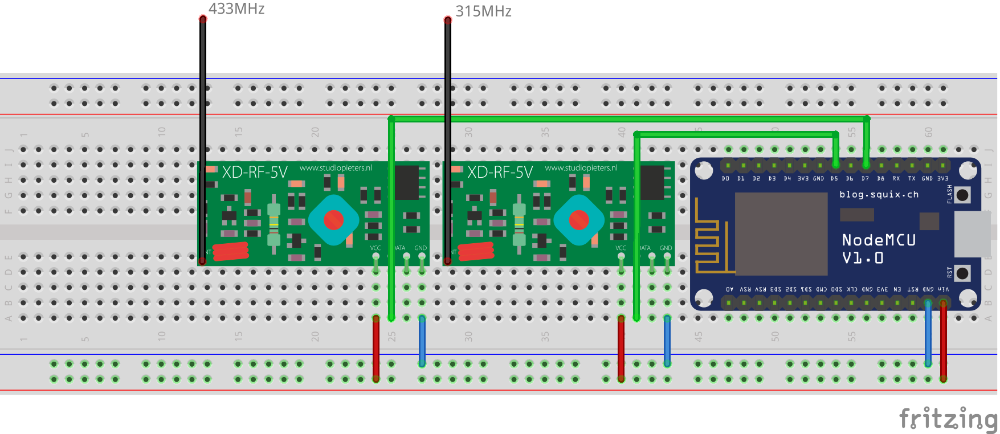

RCSwitch
========

This is a fork of [RCSwitch by whc2001](https://github.com/whc2001/RCSwitch) and extended by setReveiceRepeat() function to reduce receive time. Use setReveiceRepeat(0) to get instant switch!

For more information please go to the source repository. This repository only provides a multiple frequency receiving example using multiple modules (ReceiveDemo_Advanced_Multiple.ino). 

Wiring diagram can be checked out below:

> Credit:
> [squix78 for NodeMCU](https://github.com/squix78/esp8266-fritzing-parts),
> [AchimPieters for RF module](https://github.com/AchimPieters/Fritzing-Custom-Parts)
